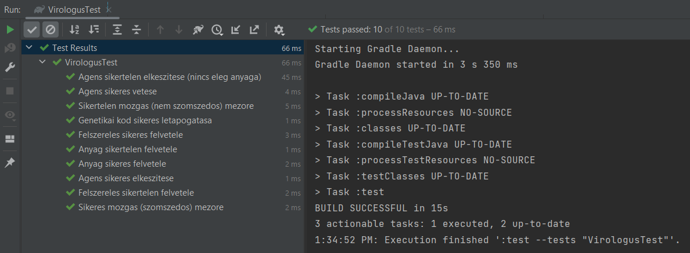
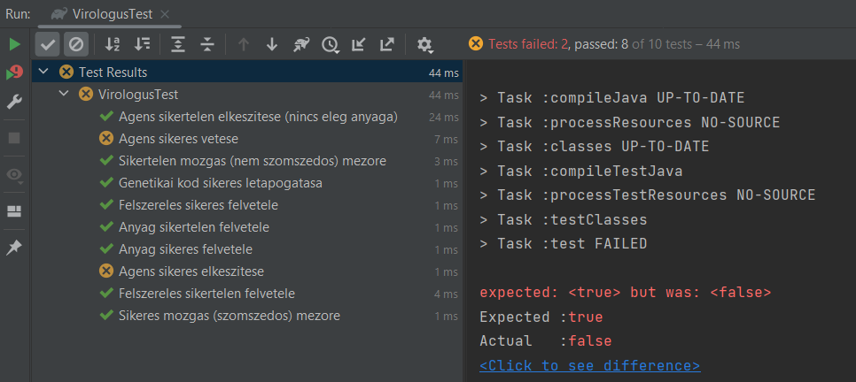
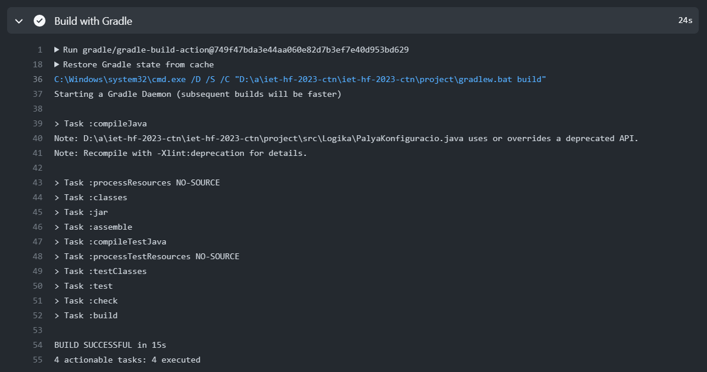
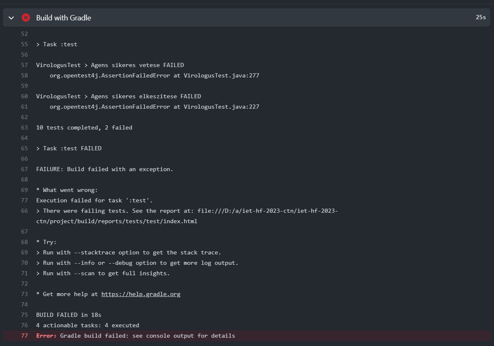
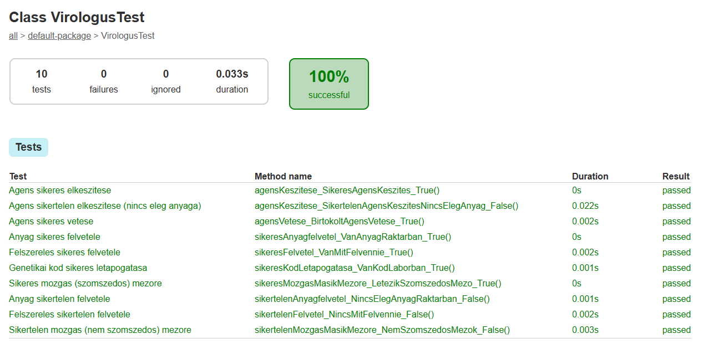
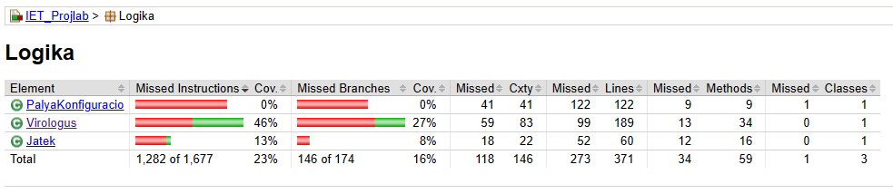

# JUnit tesztek és JaCoCo kódlefedettség

## Elvégzett munka :briefcase:

- JUnit beüzemelése gradle-el
- Test mappa utólagos hozzáadása a projekthez és bekonfigurálása
- Unit tesztek készítése a Virológus osztály fontosabb funkciójaihoz
- Tesztek futtatása és ellenőrzése
- JaCoCo beüzemelése gradle-el
- Kódlefedettség vizsgálata

## Képernyőképek :framed_picture:

    
    

JUnit tesztek (IDE futtatás)

    
    

JUnit tesztek (CI futtatás)

    
    

JaCoCo JUnit eredmények és kód lefedettség

## Eredmények és tanulságok :thinking:
A test mappa utólagos hozzádaása kifejezetten döcögősen ment. Azt hittem, hogy semmi perc alatt hozzá lehet adni viszont többször valami félre siklott így eléggé alaposan utána kellett járni, hogy pontosan miket is kell beállítani. Ez volt a kedvenc részem mert rendesen meg kellett vele küzdenem és sok érdekes dolgot tanultam meg egy-egy falba ütközéskor!
Az egységtesztek írása kellemesebb volt viszont ott a kihívást a projekt újra megértése okozta. Fura volt egy év távlatából újra megérteni a működést.
Természetesen a CI build-jét is leellenőriztem mindkét esetre (sikeres, sikertelen egységtesztek). Sokat segített, hogy az élődáson bemutatott elnevezési konvenciót alkalmaztam az egységteszteknél, sokkal egyszerűbbé tette a hiba beazonosítását.
Az utolsó felad a JaCoCo beüzemelése volt. Kifejezetten érdekes volt megnézni, hogy mire képes. Az általa előállított dokumentáció, statisztika nagyon hasznos és érdekes. Ha legközelebb projektet készítek mindenképpen használni fogom!