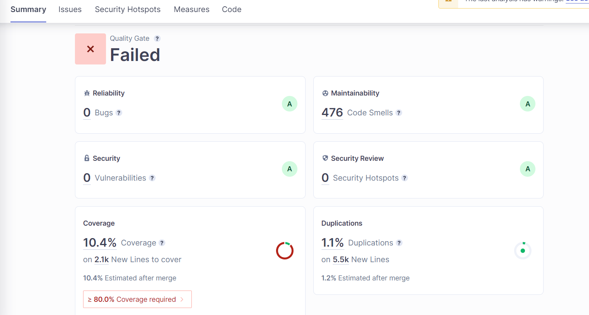

# Statikus analízis SonarCloud és SonarLint segítségével

## Elvégzett munka 

- SonarCloud beüzemelése GitHub Actions segítségével
- Hibák vizsgálata, valamennyi javítása

## Képernyőképek 

    

## Eredmények és tanulságok
A SonarCloud beüzemelése először egy kicsit döcögősen ment, hiszen a projekt GitHub-os organizationjének nem én vagyok az adminja. Ezt a problémát manuális organization és projekt létrehozásával oldottam meg, ezután a projekt megjelent a SonarCloud felületén. Először a felület rengeteg hibát adott, több Bug és Security probléma volt, ezeket átnéztem, a relevánsakat javítottam (pl.: több helyen nem volt jól vizsgálva, hogy egyes objektumok léteznek-e), ami meg nem volt probléma azt jeleztem a felületen (pl.: a random használata potenciális kriptográfiai probléma lehet, de ilyen célra nem volt használva). Ezen kívül rengeteg Code Smell van a programban, ezek közül a legtöbb triviális (pl.: nem használt importok, System.out.println használata valamilyen logger helyett), ezeknek egy részét javítottam. A Code Coverage vizsgálatával is akadtak eleinte problémáim, de sikerült ezt is hozzáadni a felülethez.
Összességében a feladat izgalmas volt, érdekes volt látni, hogy mennyi kis probléma jöhet fel egy program felépítése közben.